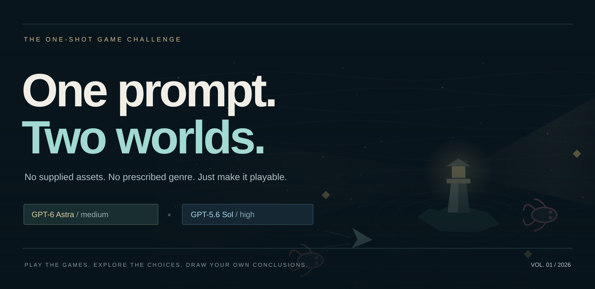
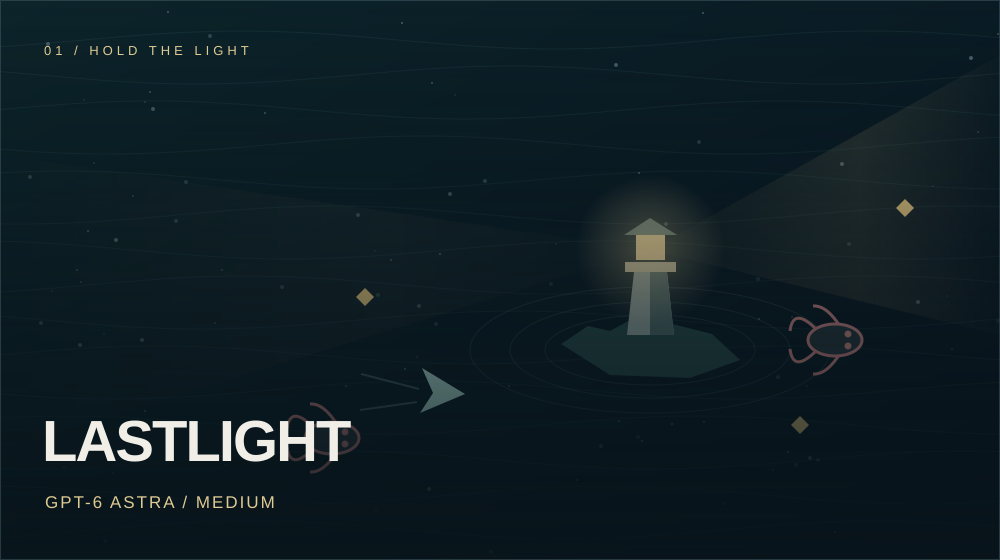
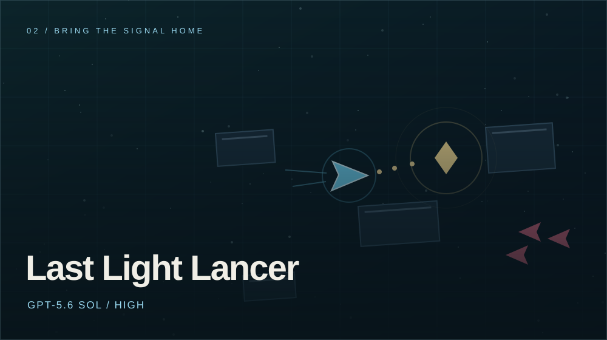

### What happens when you give two models the keys to the arcade?

One open-ended game-making challenge. No supplied assets. Two playable answers.

**[Download both games ↓](https://github.com/bitofastickler/one-prompt-two-worlds/releases/latest/download/both-games.zip)** · **[Compare the designs](#same-challenge-different-instincts)** · **[Meet the models](docs/models.md)** · **[Read the challenge](docs/challenge.md)**

**Windows batch launchers · Runs offline in a desktop browser · No accounts or API keys**

---

## Pick your world

<table>
<tr>
<td width="50%" valign="top">

### LASTLIGHT

**GPT-6 Astra · medium reasoning**

The sea has swallowed every shore but one. Pilot a skiff, keep the lighthouse burning, and make five increasingly hostile tides regret coming ashore.

**The hook:** defend two lives—your hull and the lantern—while salvaging upgrades for a final Leviathan battle.

Auto-fire · Eight upgrade types · Five tides + boss · Gentler mode

**[Download LASTLIGHT ↓](https://github.com/bitofastickler/one-prompt-two-worlds/releases/latest/download/lastlight.zip)**

[How to play](docs/lastlight.md) · [Explore the source](games/lastlight)

</td>
<td width="50%" valign="top">

### Last Light Lancer

**GPT-5.6 Sol · high reasoning**

A courier wakes in the wreckage around a dead relay. Explore the debris field, recover six signal cores, and hold the extraction ring long enough to escape.

**The hook:** chart your own route through a large arena as the pressure—and the soundtrack—build around you.

Manual aim · Three upgrade paths · Scrolling world · Adaptive music

**[Download Last Light Lancer ↓](https://github.com/bitofastickler/one-prompt-two-worlds/releases/latest/download/last-light-lancer.zip)**

[How to play](docs/last-light-lancer.md) · [Explore the source](games/last-light-lancer)

</td>
</tr>
</table>

*Cover art is an editorial illustration inspired by the games, not an in-game screenshot. Model and reasoning settings are attributed by the challenge owner.*

## Playing takes three steps

1. **Download** either ZIP above, or [get both in one ZIP](https://github.com/bitofastickler/one-prompt-two-worlds/releases/latest/download/both-games.zip).
2. **Extract all** files. Keep each game's files together; don't run it from inside the ZIP preview.
3. **Double-click the launcher:** `PLAY LASTLIGHT.bat` or `run-game.bat`. Your default browser opens the game.

Use a desktop keyboard and mouse. Edge, Chrome, or Firefox can run the games; no Node, Python, game engine, asset pack, internet connection, or AI subscription is needed to play. On macOS or Linux, open the extracted `index.html` directly instead of using the Windows batch launcher.

Prefer a repository download? **Code → Download ZIP** includes both games under `games/`. Versioned packages and checksums are also in [downloads/](downloads/README.md).

## Same challenge, different instincts

Both models chose a dark, top-down arcade game built with HTML Canvas and synthesized sound. Even the names converged on “last light.” Their more revealing differences are in **what the player does** and **where each implementation spends its complexity**.

| Design question | LASTLIGHT · Astra medium | Last Light Lancer · Sol high |
|:--|:--|:--|
| What am I trying to do? | Protect a central lighthouse, survive five tides, defeat the Leviathan | Recover six cores, return to the starting ring, hold it for ten seconds |
| What demands my attention? | Positioning, salvage, hull **and** lantern health | Navigation, manual aim, core attunement, hull and regenerating shield |
| How does the world work? | A fixed 1440 × 900 logical arena, scaled to the window | A 3600 × 2600 world with camera scrolling, obstacles, and a minimap |
| How do I fight? | Auto-target nearby enemies; hold the mouse to aim manually | Aim with the mouse; hold the left button to fire |
| What does the dash do? | Mobility, brief invulnerability, and contact damage | Mobility and brief invulnerability |
| What does E do? | A recharging shockwave that damages enemies and clears nearby shots | Hold near a signal core to attune it |
| How do builds develop? | Choose one of three sampled upgrades at each of four intermissions; eight types in the pool | Spend scrap during play on cannon, engine, and shield; three levels each |
| What creates pressure? | Timed tides, four regular enemy types, two failure conditions, then a boss | Three enemy types; threat rises with time, cores, and extraction |
| How does the music work? | A repeating eight-note synth pattern and occasional bass tone | Layered chord/scale scheduling; tempo and instrumentation react to threat and extraction |
| What brings me back? | Upgrade combinations, two difficulty settings, and a saved best score | Randomized layouts, route choices, and a saved fastest extraction |

### Our reading of the two builds

**Astra put more of its design into a staged experience.** The lighthouse is simultaneously a visual landmark, a second health bar, and a reason to collect salvage. Intermissions provide a rhythm of relief and choice; the boss and written ending give that rhythm a destination. Its gentler mode, automatic targeting, and control reminders also make the first run easier to approach.

**Sol put more of its design into movement through a system.** A larger world, obstacle collisions, a following camera, and a minimap support a player-directed route. Its upgrade economy works while combat continues. Its adaptive score is more involved than LASTLIGHT's music loop, giving this build a distinct technical strength.

**The shared aesthetic is as interesting as the contrast.** Both selected small ships, glowing salvage, hostile darkness, and survival around a last signal. The differentiation lies more in structure and mechanics than in wildly different genre selection.

These are editorial interpretations of the preserved source, not universal rankings. See the [detailed comparison and code references](docs/comparison.md), or [use the playtest scorecard](docs/playtest.md) to make your own judgment.

## What this says about the models

| | Astra run | Sol run |
|:--|:--|:--|
| Model | GPT-6 Astra | GPT-5.6 Sol |
| Reasoning setting used | **medium** | **high** |
| Delivered game | LASTLIGHT | Last Light Lancer |
| Official positioning | Most capable model for demanding end-to-end work | Flagship model for complex professional work |

OpenAI's model pages describe the families and supported reasoning settings: [GPT-6 Astra](https://developers.openai.com/api/docs/models/gpt-6-astra) and [GPT-5.6 Sol](https://developers.openai.com/api/docs/models/gpt-5.6-sol). Checked September 5, 2026.

**This is a two-build case study, not a controlled benchmark.** “Medium” and “high” are configuration labels, not equal compute budgets across different models. We do not have audited per-run cost, token counts, generation times, or equivalent environment records. We also do not claim that the supplied folders prove untouched first-turn outputs. The games are preserved as supplied for this comparison.

[Model facts and interpretation limits →](docs/models.md) · [Prompt, provenance, and method →](docs/challenge.md)

## The challenge

> Let’s try something fun. I want you to make me the best fully playable PC game you can with minimal input from me. I should be able to quickly play it locally without providing any game assets. You can write it in any language you want but I have to be able to run it from a batch file and you have to finish it in one shot. The genre, tone, and style are completely up to you. Are you up for the challenge?

## Explore the exhibit

| If you want to… | Start here |
|:--|:--|
| Play immediately | [Both games ZIP](https://github.com/bitofastickler/one-prompt-two-worlds/releases/latest/download/both-games.zip) |
| Learn the controls and strategies | [LASTLIGHT guide](docs/lastlight.md) · [Lancer guide](docs/last-light-lancer.md) |
| Compare creativity and implementation | [Design analysis](docs/comparison.md) |
| Understand model differences | [Official facts and experiment limits](docs/models.md) |
| Reproduce the packages or check source integrity | [Reproducibility](docs/reproducibility.md) · [Manifest](manifest.json) |
| Review exactly what was tested | [Validation record](docs/validation.md) |
| Report a problem or share a playtest | [Open an issue](https://github.com/bitofastickler/one-prompt-two-worlds/issues/new/choose) |

---

**The interesting part isn't choosing a winner. It's playing the difference.**

An independent experiment curated by [bitofastickler](https://github.com/bitofastickler). Not an official OpenAI benchmark.

